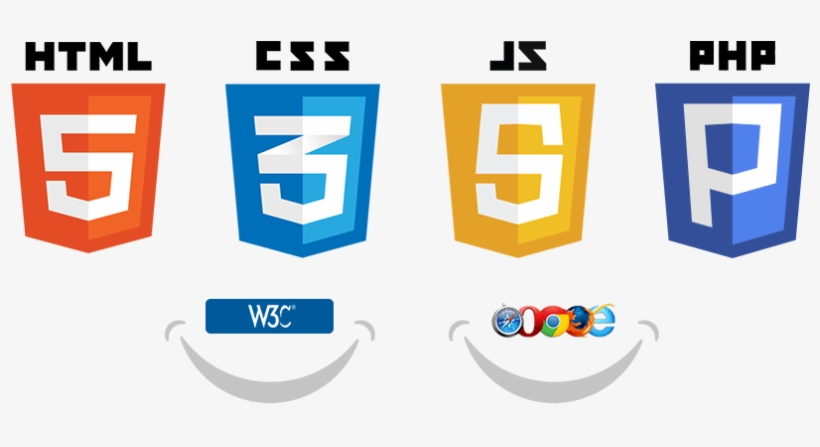

*Javascript: One of the four cornerstones in all of your favorite websites*

I've been creating websites for the last 10 years for 3 different businesses I started.

The companies didn't revolve around the websites, they were physical product based businesses. But without a customized website that fit my idea of what my customers wanted I don't believe we would have reached over $3000 per day in online sales.

The four main building blocks I relied on were Javascript, PHP, HTML and CSS.  None were more important than the other, because without any one of them, I wouldn't have had all the functionality I needed.

I've been at this for more than 10 years and I can tell you, Javascript is the practically the same and we will continue needing it for a long long time to come.

## When it comes to interaction

Without Javascript we wouldn't have slideshows. Without slideshows our customers would have had to scroll down a long page to view pictures of our products.  Javascript not only allows slideshows, but interaction.  When a viewer wants to scroll faster than the alloted time of the slideshow he can click a button which moves the slides forward.  He can also click on the image itself and view a larger version of it.

Have you ever updated your bio on a website.  Each field is already filled with your previously entered information.  The way I made this possible was by pulling the data with php and then assigning it to a javascript variable array and using that array to populate the fields.  We can also use Javascript variables to collect user input into arrays and then send that to PHP for storage.

You wouldn't have drop down menues without Javascript.  Javascript allows realtime manipulation of the css on websites which is how you can click on a menu button and then see a box with settings, profile, etc.

## In the context of engineering

Ever hear people ragging on engineering companies for delivering late and way over budget? Well, some engineering jobs are really difficult, especially if the requirements and funding are undulating underneath you. Because of the nature of the problem, sometimes engineering firms require large amounts of engineers and workers, inviting further problems and delays.

The Honolulu Rail project at home has become this sort of poster child of failure, budget overrun and overall incompetence in Hawaii. Well, working though regulatory boards and fiscal procedures in Hawaii seems like it's a mind bogglingly difficult job to do. Granted, there might be some fishy stuff going on, but I refuse to believe that everyone is involved for nefarious reasons.

The problem of creating an unprecedented public transportation backbone on an island is difficult! I'm not sure we would have done it right, even if the best people were involved.

## In the context of relationships

So in the end, we realize that all engineering and programming is there for a reason - to serve human needs. Maybe that's why those things are difficult, because they both involve humans and are for humans.

Relationships, regardless if they're romantic or not take work. Humans are fickle creatures and relationships can come and go with the wind. To properly maintain something over time requires work. Family takes work. Marriage takes work. We live to figure out what works and what doesn't and hope that as we move forward we're improving.

Relationships have always been difficult, and by nature will continue to be so.

## Okay!

So back to the original premise; why is being one of the club officers so difficult?

And the final answer - it's supposed to be difficult, and it's supposed to challenge you, just like everything else that humans do that is difficult: programming, engineering, engaging in relationships, pondering the universe, etc.

Ultimately the question you should really ask yourself if something if particularly difficult is then "is it worth it"? That is something that is context specific and only you can answer yourself.
