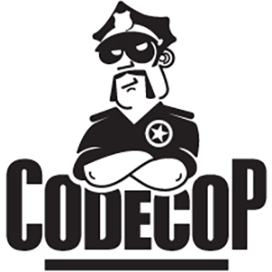

## What is the point of coding standards?
  Coding standards are annoying to use when you start learning them.  This is because you probably haven't worked in an environment with many other programmers working together on a single project.  If you had, you would realize that without standards we all would have very different coding styles.  There are two main reasons for implementing coding standards into a company.  First, the code could be very hard to read if it's spaced way to far apart or crammed way to close together.  There are so many different ways that code style can be different from one programmer to the next, including curly braces, spaces, indentation, comments, lack of comments and more.  What you want is to open a file and not be able to tell if you created it or not.  You want the coding style to be exactly like yours so you can understand every line and start coding anywhere in the file as if you wrote the original.
  
  The second reason for implementing coding standards in a company is that it can actually help you learn a programming language.  For example, if a company requires it's programmers to use => notation when writing a function, it will force everyone to learn what exactly the documentation for => is and how it works.  If a company kept their coding standards up to date with javascript ES, then their programmers would be trained on the most current and best programming methods available.  But wouldn't this slow down work and cost the company money to train everyone on up to date programming methods? At first yes, there will be a noticable speed bump, but the programmers overall speed will be faster then before and in the long run he or she will make up for the lost time and the company will actually profit more because of this.
  
 ## What is ESLint?
  ESLint is an open source JavaScript linting utility originally created by Nicholas C. Zakas in June 2013.  ESLint is a coding standard program that automatically checks your work for you to make sure you are keeping inline of their standards, and that everyones code passes the same tests.  For example ESList makes you use single quotes when quoting a string.  The bennefit of this is that your code will be consistent with your colleague's.  "If your colleague has wrapped a long string in double quotes, and you change one line for the purpose of quoting "part of the string." The program will fail, becaues it will start at he first double quotes and end at the beginning of the section you tried to quote."  'Had your colleague used single quotes, "you could then" use double quotes within that string and correctly quote the section you were intending.'
  
  ESList is great because it also lets you know where the functional errors in your code are.  This is great, becaues if you're code isn't working, you don't want to have to search every line for a typo or incorrect syntax.  ESList will make sure you used }, ==, +=, let, etc correctly.  It is a very valuable tool to have and will most likely be implemented at your future office when you get a job, so take the time to learn it now.
