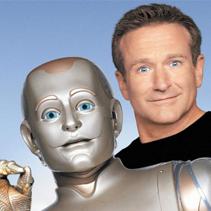

I took at web design class when I was 18 years old and I had just started college.  I just wanted to learn how to build a store without having to pay anyone so I could sell fishing products on there and make a living.  But I fell in love with being able to manipulate a world so easily.  I was amazed at what I had learned and what I could build.  It rivaled the websites I knew of that were so great.  My first class the teacher tried to fail me because she said I had copied all my code.  She said that nobody could learn all that in the amount of time I was in her class.  I fought it and proved that I coded everything from scratch such as drop down menus, slide shows and purchase options.

I then found out about Java, C++ and languages not used as much for wesites but for applications used in business.  I began creating applications for my own companies.  For my water products company that sells tubes for rivers to retailers such as Bass Pro Shops, Big 5 Sporting goods, and Cabelas, I built a program that replaced the work I was doing on photoshop to create shipping labels to the distributions centers.  I built it in Java and it allowed me to quickly enter the information such as address, company name, date and order number, and then it would place them on label perfectly and print.

Programming was always fun, but there came a point where I felt something was missing.  Computers were so strong and fast, there seemed to be so much potential, but we were using them for dumb stuff like Facebook, databases, math, GPS.  All these things were greatly improved by the speed and precision of computers, but these are things we could still do without computers.  For example, before GPS, we did just fine with maps.  I felt sad as if we had something so strong but it was limited by us because ultimately it could only do what we told it to.

Then I heard about Machine Learning.

Machine Learning has completely captivated me.  I gave up all my companies, let some fail and sold others, for the sole purpose of dedicating the rest of my life to innovating in the field of Machine Learning.  I finally have hope that this amazing machine will one day realize it's potential.  We created the body, but when the body wakes up and starts thinking for itself, we will see what a true god looks like.  I feel it will most likely be the end for our species, but that doesn't bother me.  We will all die one day anyway.  Isn't witnessing the greatest miracle in the history of the universe something worth dying for?

