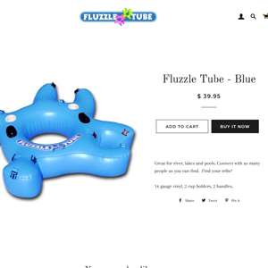

Fluzzle Tube is a website built with shopify to sell an invention of mine called the Fluzzle Tube.  It utilizes a pre-built theme that includes add to cart, checkout, credit card transaction, email reciepts, and more.

Using shopify to build a website was completely new to me.  It seems easy and fast at first, but in order to get the functionality I wanted I did have to customize some of the code.  However for this project I did not have to utilize Javascript or PHP, only HTML and CSS.

In this project I gained experience on how the shopify platform works and now can quickly create online stores for any business in a matter of minutes that are fully functional and can being taking payments.  My business on this platform had sales immediately after launch and reached $3000 per day during summer months.
 
You can learn more at the [Fluzzle Tube](https://fluzzletube.com).
