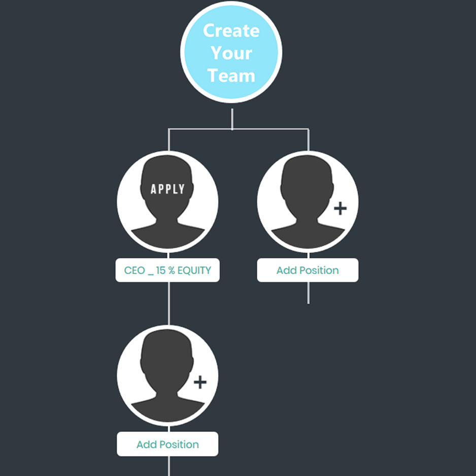
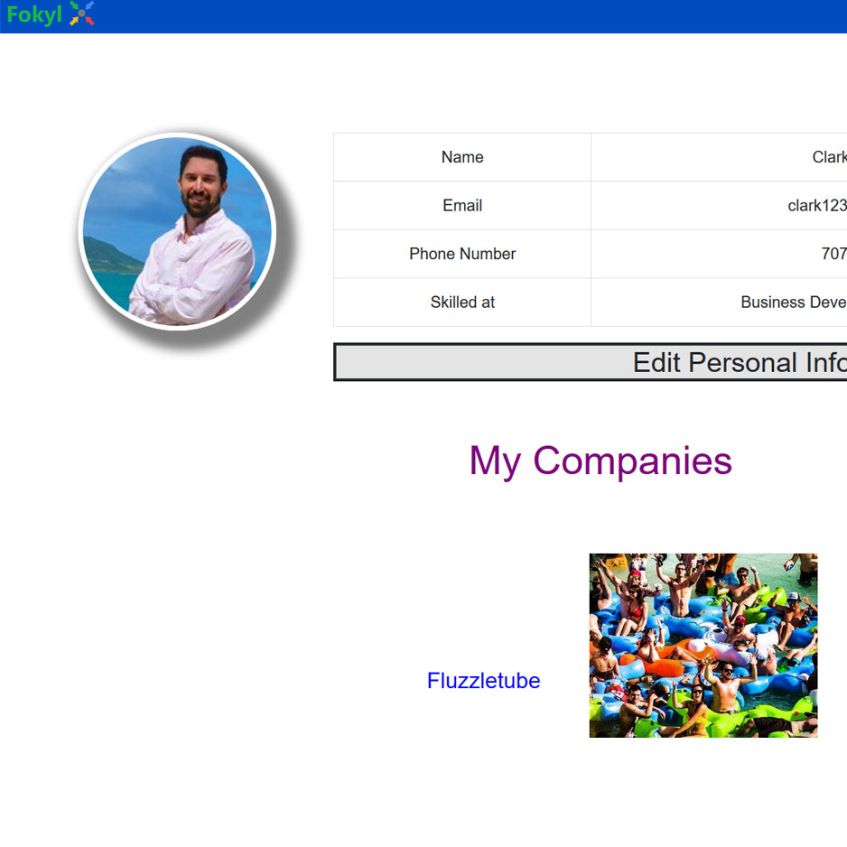
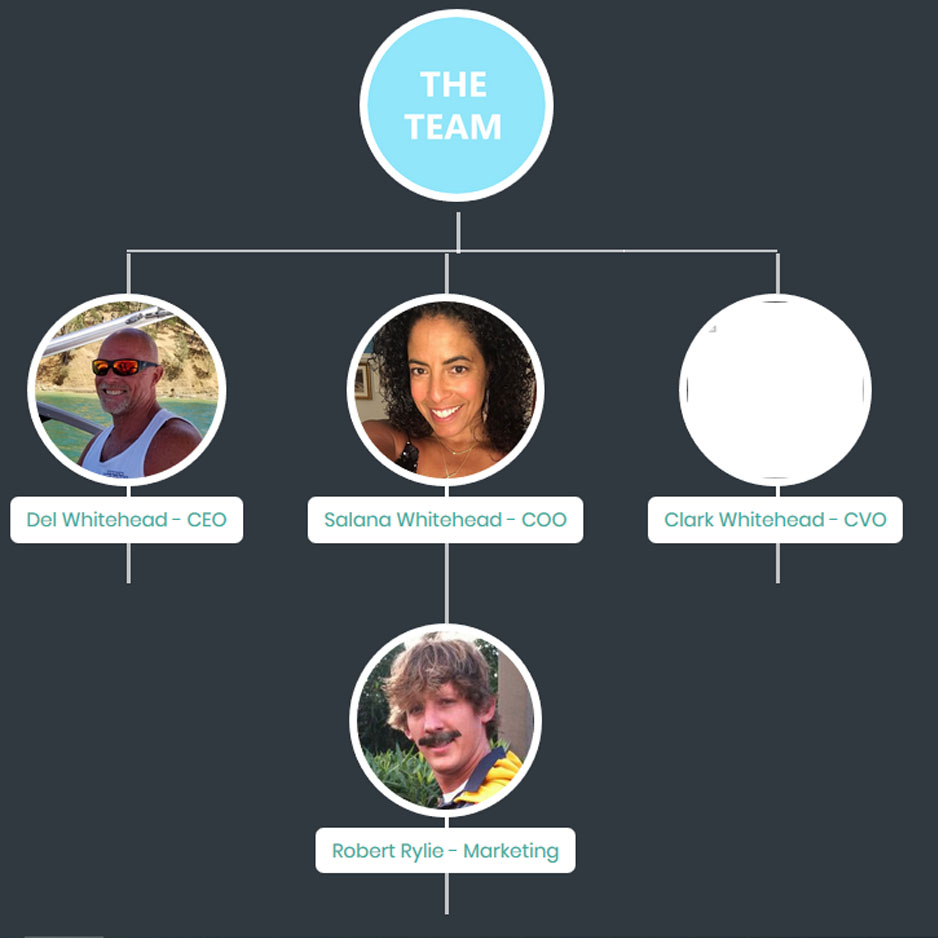

<div class="ui small rounded images">
  
  
  
</div>

Fokyl.com is a site where entrepreneurs can come together, build teams, and then execute on business idea.  They can interact on the site remotely, so for example 5 people can come together from completely different parts of the world and form a company.  It really only requires one person to start the company though.  The functionality of the site allows the creator to start a company tree and place positions on that tree that they need filled.  This functionality was created using Javascript and PHP.

For this project I was the only programmer in every aspect.  I was working with a marketing specialist who helped design the look and feel of the site, but all the code is my own.  This project took me three months to get to where it is now.  The three main technical abilities demonstrated in this project are the "Create Company", "Facebook Login", and "My Account" pages.

Here is some code that illustrates how I created real time Add Position buttons after each submitted position:

```js
var newHTML = '<div id="'+id.substring(0, id.length - 2)+siblingNum+'new" class="hv-item-child"><!-- Key component --><div class="hv-item"><div class="hv-item-parent"><div id="'+id.substring(0, id.length - 2)+siblingNum+'" class="person"><p id="'+id.substring(0, id.length - 2)+siblingNum+'txt" class="name">Add Position</p></div></div><div id="'+id.substring(0, id.length - 2)+siblingNum+'children" class="hv-item-children"></div></div></div>';
```

You can learn more at the [Fokyl Website](https://fokyl.com/).

