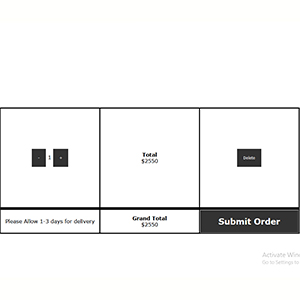

<div class="ui small rounded images">
  
  
  
</div>

Hillside Chocolates is a business I created in California in 2015 to sell medical cannabis products to retailers in San Francisco.  The inventory is stored on a phpMyAdmin database and is pulled into the products page using PHP and Javascript.  All the inventory is updated from a backend site I created to keep track of quanitity and live updates the main site when items are "Out of Stock".  Javascript enables the user to view large images of each product, add items to cart, update quantities they want to order from inside the cart, checkout and then recieve an email receipt.

Here is some code that illustrates the PHP used to add new products to the store:

```php
$query = "INSERT INTO `products` (product, picture, name, type, environment, thc, milliliters, milligrams, cbd, price, stock, numUnits) VALUES (:product, :picture, :name, :type, :environment, :thc, :milliliters, :milligrams, :cbd, :price, :stock, :numUnits)";
	$statement = $db->prepare($query);
	$statement->bindValue(':product' , $product);
	$statement->bindValue(':picture' , $image);
	$statement->bindValue(':name' , $name);
	$statement->bindValue(':type' , $type);
	$statement->bindValue(':environment', $environment);
	$statement->bindValue(':thc', $thc);
	$statement->bindValue(':milliliters' , $milliliters);
	$statement->bindValue(':milligrams' , $milligrams);
	$statement->bindValue(':cbd' , $cbd);
	$statement->bindValue(':price' , $price);
	$statement->bindValue(':stock' , $stock);
	$statement->bindValue(':numUnits' , $units);
	$statement->execute();
	$statement->closeCursor();
```

You can learn more at the [Hillside Website](http://hillsidechocolates.com).

