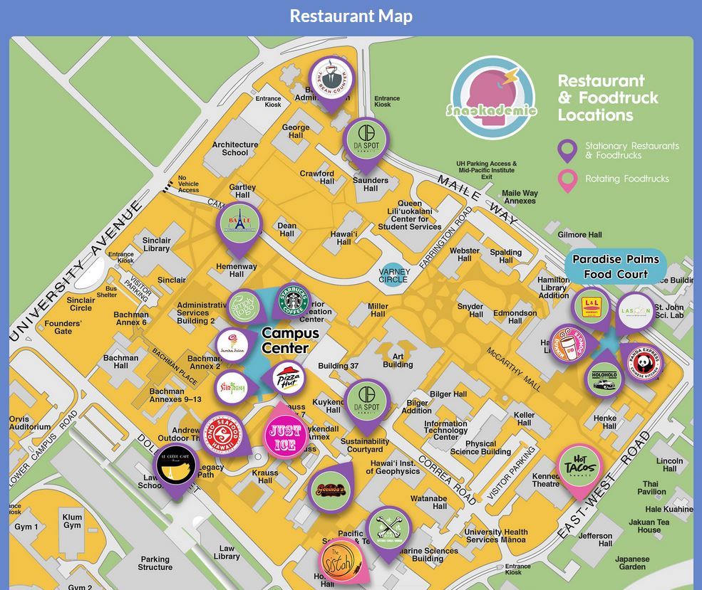
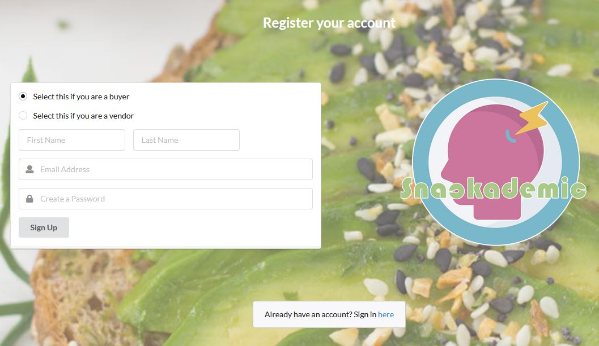
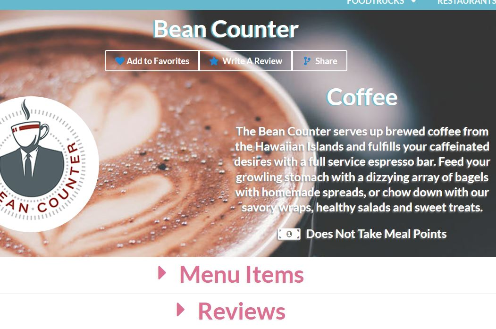

<div class="ui small rounded images">
  
  
  
</div>

The goal of Snackademic is to give students at UH a way to keep track of all their favorite foodtrucks and restaurants across campus, see what their menu offerings are, filter by style of food, and see what hours they are open. In the case of foodtrucks, the app will let the student view exactly where on campus they are located for the day. The app will also let UH students rate their favorite restaurants by creating user profiles. User profiles can also be created for restaurants and admins.

Here is a link for installation instruction - <a href="https://the-back-corner.github.io/"> Snackademic Homepage </a>

Here is an example of the code used in our application

```html
class App extends React.Component {
  render() {
    return (
        <Router>
          <div>
            <NavBar/>
            <Switch>
              <Route exact path="/" component={Landing}/>
              <Route path="/signin" component={Signin}/>
              <Route path="/signup" component={Signup}/>
              <Route path="/foodtruck/:_id" component={FoodTruck}/>
              <Route path="/restaurant/:_id" component={Restaurant}/>
              <Route path="/Hours" component={Hours}/>
              <Route path="/Map" component={Map}/>
              <ProtectedRoute path="/favorites" component={FavoritesPage}/>
              <ProtectedRoute path="/myeatery" component={MyEatery}/>
              <ProtectedRoute path="/add" component={AddStuff}/>
              <ProtectedRoute path="/edit/:_id" component={EditStuff}/>
              <ProtectedRoute path="/edit/:_id" component={EditStuff}/>
              <AdminProtectedRoute path="/allaccounts" component={AllAccountsPage}/>
              <ProtectedRoute path="/signout" component={Signout}/>
              <ProtectedRoute path="/userprofile" component={UserProfilePage}/>
              <Route component={NotFound}/>
            </Switch>
            <Footer/>
          </div>
        </Router>
    );
  }
}
```


<a href="https://github.com/the-back-corner">Our GitHub Page</a>
